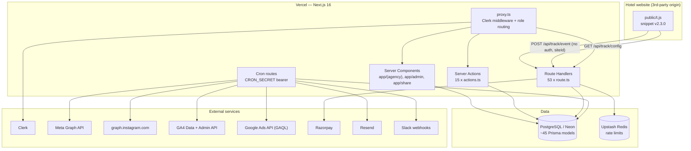
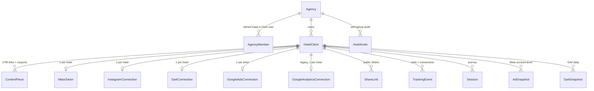
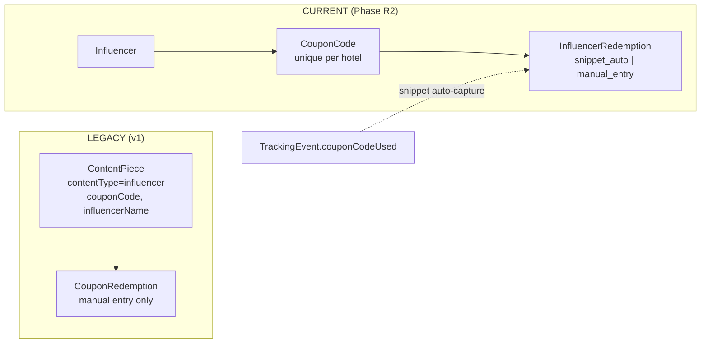
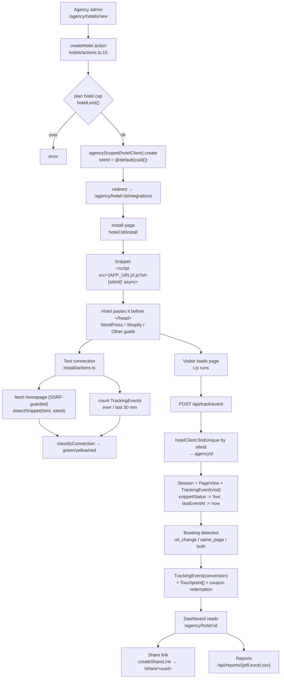
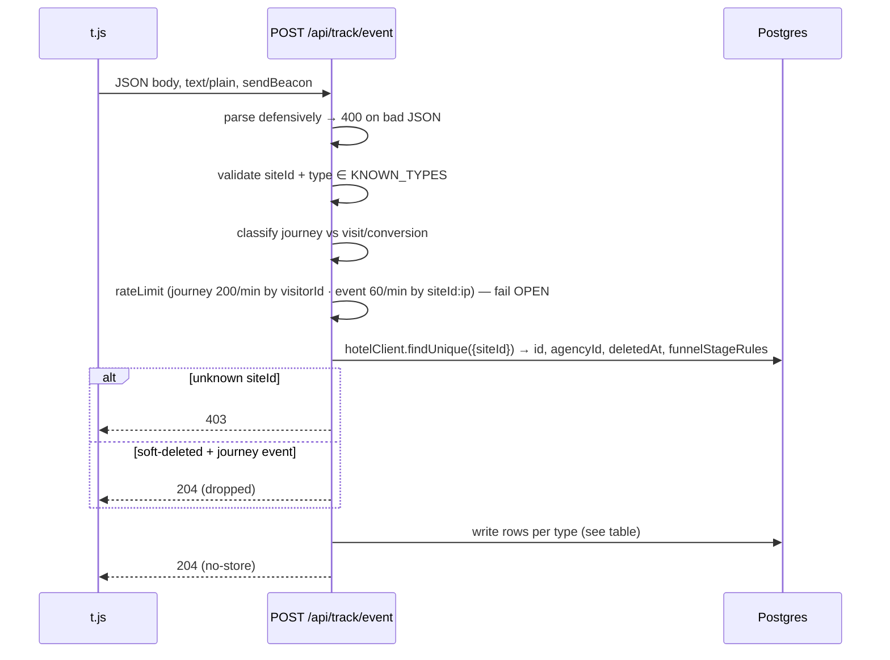
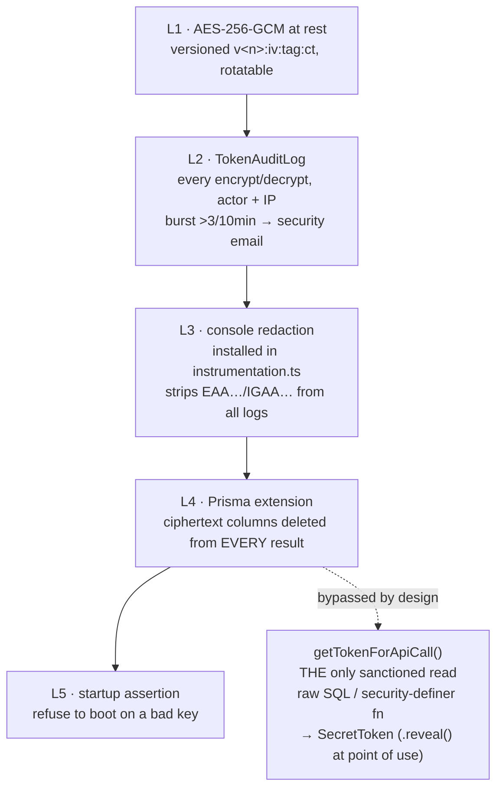
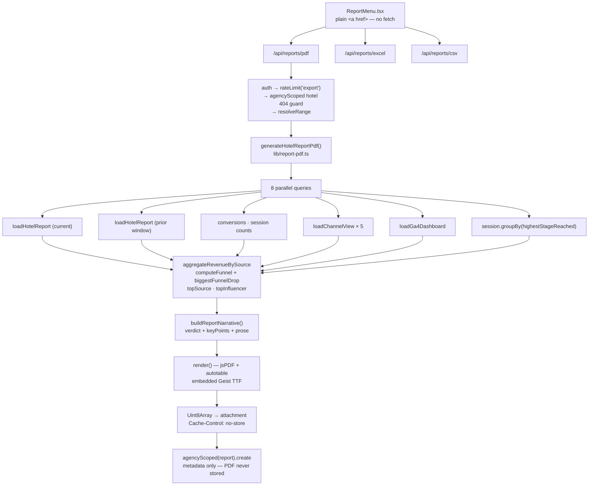
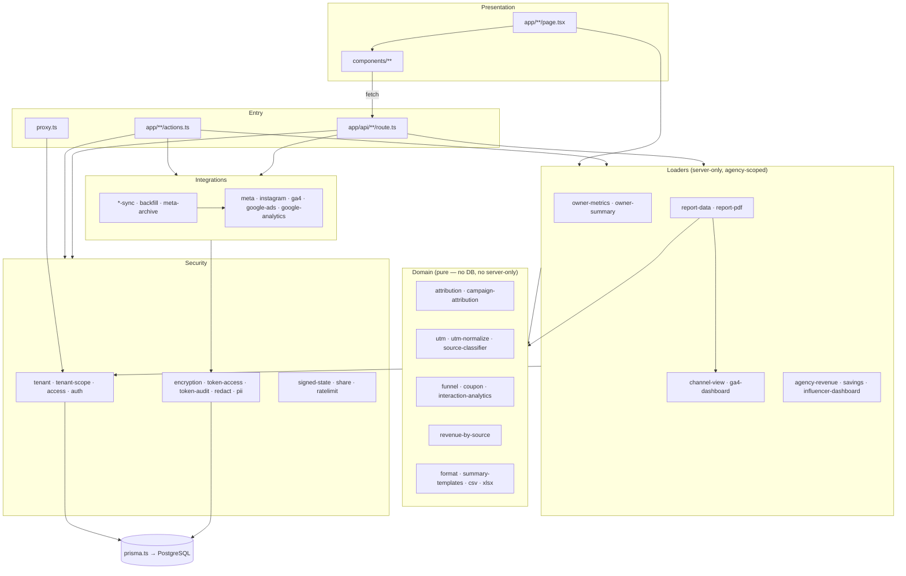
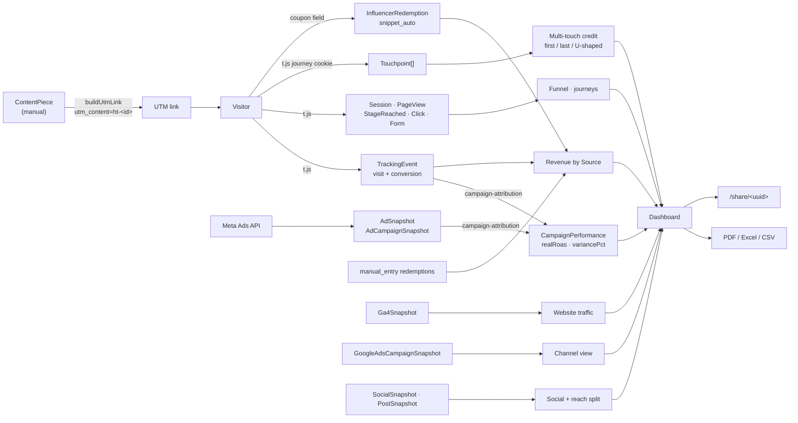

# HotelTrack — Reverse-Engineered Architecture

**Status:** descriptive, not prescriptive. This documents the code **as it is on
`production-readiness/first-customer` @ `99f31bc`**, including places where the
code disagrees with the existing docs. Nothing here was changed to write it.

Where this document and `README.md` / `MULTITENANCY.md` / `INTEGRATIONS.md` /
`docs/architecture/integrations.md` disagree, **this document follows the code**
and the divergence is called out explicitly.

---

## Table of contents

1. [Overall architecture](#1-overall-architecture)
2. [Folder responsibilities](#2-folder-responsibilities)
3. [Database](#3-database)
4. [Hotel onboarding flow](#4-hotel-onboarding-flow)
5. [Tracking architecture](#5-tracking-architecture)
6. [Integrations](#6-integrations)
7. [Report generation](#7-report-generation)
8. [Dashboard](#8-dashboard)
9. [Dependency diagrams](#9-dependency-diagrams)
10. [Architectural risks](#10-architectural-risks)

---

## 0. Executive summary

HotelTrack is a **multi-tenant SaaS for marketing agencies that manage hotel
clients**. It closes the loop *content → visit → booking → revenue* by combining
a first-party JavaScript tracking snippet installed on the hotel's own website
with synced data from Meta Ads, Google Ads, GA4 and Instagram.

Five things about the current state are load-bearing and **not** described in any
existing doc:

| # | Reality | Where |
|---|---|---|
| 1 | **Access is locked to `@socialhippi.com` staff.** `getAgencyContext()` re-checks the email domain on *every* agency-scoped read. No external agency can hold an account today. | `lib/tenant.ts:56`, `lib/access.ts:24` |
| 2 | **The Hotel Client role is fully disabled.** `hotelAccessNeutralized()` returns `true` unconditionally, killing `/hotel/*`, `/h/*` and every `/api/hotel/*` route. | `lib/hotel-auth.ts:14` |
| 3 | **Billing is off.** `BILLING_ENABLED` defaults to `false`; all plan limits and the paywall short-circuit to unlimited. | `lib/billing-config.ts:29` |
| 4 | **RLS is inert.** Policies exist and are proven by a smoke test, but the app connects as the table owner and `lib/rls.ts` has zero call sites. Isolation rests entirely on the application layer. | `prisma/migrations/20260530100000_enable_rls/migration.sql:10` |
| 5 | **Hotel self-signup is disabled.** `/join/<code>` renders "signups are closed" and the server action hard-refuses. | `app/join/[inviteCode]/actions.ts:44` |

The net effect: what is running is a **single-tenant internal tool operated by
Social Hippi staff on behalf of hotels**, built on a codebase that is
architecturally ready to become the multi-tenant product described in
`CLAUDE.md`. Everything needed to flip it back is intact and gated behind
booleans.

---

## 1. Overall architecture

### 1.1 Stack

| Layer | Technology | Notes |
|---|---|---|
| Framework | **Next.js 16.2.6** App Router + TypeScript 5 | Note: `middleware.ts` is renamed **`proxy.ts`** in v16 |
| React | 19.2.4 | Server Components by default |
| Database | PostgreSQL (**Neon**) via **Prisma 7** | Driver adapter `@prisma/adapter-pg`, *not* the built-in engine |
| Auth | **Clerk** (`@clerk/nextjs` 7.4.1) | Platform role in `publicMetadata.role` |
| Billing | **Razorpay** (INR, paise) | ⚠️ README/MULTITENANCY still say Stripe |
| Email | **Resend** | |
| Charts | **Recharts** | Client-side only; the PDF draws its own |
| Snippet | Vanilla JS, built with **esbuild** | `scripts/snippet.src.js` → `public/t.js` |
| Exports | **jsPDF** + `jspdf-autotable`, **xlsx**, hand-rolled CSV | |
| Rate limiting | **Upstash Redis** sliding window, in-memory fallback | |
| Hosting | **Vercel** (crons in `vercel.json`) | |
| Tests | **vitest** (31 files), CI on GitHub Actions with a Postgres 17 service | |

### 1.2 Runtime shape



### 1.3 Next.js structure

Four kinds of server entry point:

1. **Server Components** — the dashboards. They query Prisma **directly**; they
   do not call their own API routes. `app/(agency)/agency/(app)/hotel/[id]/page.tsx`
   (2019 lines) is the largest and issues ~20 parallel queries.
2. **Server Actions** (15 files) — all mutations. Each re-verifies authorization
   server-side because a server action is a POST endpoint.
3. **Route Handlers** (53 files) — public tracking ingest, cron jobs, OAuth
   callbacks, webhooks, exports, and JSON feeds for *client* components
   (`ChannelView`, `RevenueBySource`, `PerformanceOverview`, …).
4. **`proxy.ts`** — Next 16's renamed middleware, running `clerkMiddleware`.
   Confirmed against `node_modules/next/dist/docs/…/proxy.md:11`. It runs on the
   **Node.js runtime** by default (`proxy.md:219`), which is why its
   module-level `roleCache` Map survives warm requests.

`app/layout.tsx` calls `validatePlatformEnv()` at module load, and
`instrumentation.ts#register()` installs console redaction and asserts the
encryption keys before the server serves a single request.

### 1.4 API routes

| Group | Routes | Auth |
|---|---|---|
| `/api/track/*` | `config`, `event` | **None** — public `siteId`, CORS `*`, rate-limited |
| `/api/auth/{meta,instagram,ga4,google-ads}/{start,callback}` | 8 | `requireAdmin()` on start; HMAC signed state on callback |
| Cron | `meta/sync`, `meta/refresh-tokens`, `instagram/{sync,detect-tags,refresh-tokens}`, `ga/sync`, `ga4/sync`, `google-ads/sync`, `budget/check`, `billing/renewal-reminders`, `alerts/run`, `cron/cleanup-journey` | `Authorization: Bearer $CRON_SECRET` |
| `/api/agency/**` | overview, revenue-by-source (+drill-down), savings, slack/test, export, and per-hotel: summary, owner-metrics, channel-view, revenue-by-source, savings, redemptions, influencer-options/posts, instagram-reach-split, unattributed-mentions | Clerk session → `agencyScoped` |
| `/api/hotel/**` | mirrors of the above for hotel owners | `requireReadAccess` — **currently always denies** |
| `/api/reports/{pdf,excel,csv}` | 3 | Clerk session + agency-scoped 404 guard |
| `/api/{hotels,content}/export` | 2 | Clerk session |
| `/api/webhooks/razorpay` | 1 | Razorpay HMAC-SHA256 over the raw body |
| `/api/guide` | 1 | Public; records analytics only when a session exists |

### 1.5 Database access

Every query goes through one of two wrappers in `lib/tenant-scope.ts`:

- `agencyScoped(model)` — resolves the agency from the Clerk session (or an
  `AsyncLocalStorage` override) and injects `{ agencyId }`.
- `agencyScopedFor(agencyId, model)` — same injection with an explicit id, for
  code with no session: cron loops, the public `/share` page, tracking ingest.

`findUnique` is silently rerouted to `findFirst` so a non-unique `agencyId` can
be added to the `where`. `HotelClient` reads additionally get an implicit
`deletedAt: null` unless `includeDeleted: true` is passed.

Two Prisma extensions harden secrets (`lib/prisma.ts:26-58`): every result of
`metaToken`, `instagramConnection`, `googleAnalyticsConnection`, `ga4Connection`
and `googleAdsConnection` has its ciphertext columns **deleted from the result
object**. The only sanctioned read path is `getTokenForApiCall()`, which uses raw
SQL (bypassing the extension) and writes an audit row.

### 1.6 Authentication and roles

```mermaid
flowchart LR
  U[Request] --> P{proxy.ts}
  P -->|public route| OK[handler]
  P -->|no userId| SI[redirectToSignIn]
  P --> R{"role<br/>(session claim,<br/>else Clerk API + 5min cache)"}
  R -->|/agency/*| A{agency_admin?}
  R -->|/admin/*| S{super_admin?}
  R -->|/hotel/*| H{agency_admin?}
  A -->|yes| L1["agency (app) layout:<br/>staff email · suspended ·<br/>contact info · paywall"]
  A -->|no, role-less| ONB[/agency/onboarding]
  S -->|yes| ADM["app/admin/layout.tsx<br/>re-checks super_admin"]
  H -->|yes| DEAD["page 404s —<br/>hotelAccessNeutralized()"]
  L1 --> GAC["getAgencyContext()<br/>⚠ isAllowedStaffEmail gate"]
  GAC --> Q[agencyScoped queries]
```

Two orthogonal role systems:

- **Platform role** (Clerk `publicMetadata.role`): `super_admin | agency_admin |
  hotel_client` — `types/globals.d.ts`.
- **Member role** within an agency (`AgencyMember.role`): `admin | analyst`.

`requireAgencyId()` **explicitly rejects `super_admin`** — super admins have no
single-agency context and run deliberately un-scoped queries under
`requireSuperAdmin()`.

### 1.7 Background jobs

All 11 crons are declared in `vercel.json` and gated by an inline `CRON_SECRET`
bearer check (there is no shared helper — the check is copy-pasted per route).
A cron route must **also** be listed as public in `proxy.ts` or Clerk redirects
the session-less request to sign-in.

| Time (UTC) | Path | Job |
|---|---|---|
| 01:00 | `/api/cron/cleanup-journey` | 90-day Session/PageView retention sweep |
| 02:00 | `/api/meta/sync` | Meta Ads daily + `refreshCampaignPerformance` + **`runDailyAlerts` piggyback** |
| 03:00 | `/api/instagram/sync` | IGAA account + post metrics |
| 03:00 | `/api/budget/check` | Budget threshold alerts (80/90/100%) |
| 03:30 | `/api/instagram/detect-tags` | Influencer tag detection / reach split |
| 04:00 | `/api/ga/sync` | **Legacy** service-account GA sync |
| 04:30 | `/api/ga4/sync` | GA4 OAuth sync (11 reports/hotel) |
| 05:00 Mon | `/api/instagram/refresh-tokens` | Roll IGAA tokens expiring ≤14 days |
| 05:15 | `/api/google-ads/sync` | GAQL campaign sync — **⚠ blocked by `proxy.ts`, never runs** |
| 06:00 | `/api/meta/refresh-tokens` | Meta OAuth refresh + manual-token expiry warnings |
| 09:00 | `/api/billing/renewal-reminders` | Razorpay renewal emails |

### 1.8 Integrations at a glance

| Integration | Auth | Scope | Storage | Status |
|---|---|---|---|---|
| Meta Ads | OAuth **or** pasted long-lived token | per **hotel** | `MetaToken` | Live |
| Instagram organic | IGAA OAuth (Instagram Login) | per hotel | `InstagramConnection` | Live |
| GA4 | Google OAuth | per hotel | `Ga4Connection` | Live |
| Google Ads | Google OAuth (shared client + dev token) | per hotel | `GoogleAdsConnection` | Live, **cron blocked** |
| Legacy GA | Service-account JSON | per hotel | `GoogleAnalyticsConnection` | **Superseded but still running** |
| Razorpay | API keys + webhook HMAC | per agency | `Agency.razorpay*` | Live but bypassed (`BILLING_ENABLED=false`) |
| Slack | Incoming webhook | per agency | `Agency.slackWebhookUrl` | Live — budget alerts only |
| Resend | API key | platform | — | Live |

---

## 2. Folder responsibilities

```
SAAS-PROJECT/
├── app/                  Next.js App Router — pages, layouts, actions, API routes
├── components/           Shared React components (dashboard, report, ui, nav, theme, agency)
├── lib/                  85 modules — ALL business logic, integrations, security
├── prisma/               schema.prisma (1599 lines) + 40 migrations + seed
├── scripts/              snippet source, seeds, diagnostics, smoke tests, key rotation
├── tests/                31 vitest files — isolation, encryption, attribution, PDF
├── public/               t.js (built), docs, og images
├── docs/                 operator + architecture docs (this file)
├── types/                globals.d.ts — Clerk session claim + role typing
├── proxy.ts              Next 16 middleware — auth + role routing
├── instrumentation.ts    startup: console redaction + encryption key assertion
├── next.config.ts        security headers + CSP (no other config)
└── vercel.json           11 cron schedules
```

### 2.1 `app/`

| Path | Responsibility |
|---|---|
| `app/layout.tsx` | Root: `ClerkProvider`, `ThemeProvider`, calls `validatePlatformEnv()` |
| `app/page.tsx` | Public marketing landing (691 lines) — the only logged-out surface |
| `app/(auth)/` | Clerk `<SignIn>` / `<SignUp>` catch-all routes |
| `app/(agency)/agency/onboarding/` | Agency provisioning. **Outside** the `(app)` group so it isn't paywalled |
| `app/(agency)/agency/billing/` | Razorpay checkout + plan management. Outside `(app)` to avoid a redirect loop |
| `app/(agency)/agency/suspended/` | Terminal page for super-admin-suspended agencies |
| `app/(agency)/agency/(app)/` | **The real product.** Its `layout.tsx` is the guard chain: staff email → suspension → contact info → paywall |
| `…/(app)/dashboard/` | Agency-wide rollup |
| `…/(app)/hotels/`, `hotels/new/` | Hotel list + create form |
| `…/(app)/hotel/[id]/` | Per-hotel dashboard (2019 lines) + `install/`, `integrations/`, `journeys/` |
| `…/(app)/content/` | Content library + UTM link generation |
| `…/(app)/influencers/` | Influencers + coupon codes (two tabs) |
| `…/(app)/settings/` | Meta token, notifications, invite codes, agency contact |
| `…/(app)/alerts/` | Alert history |
| `app/admin/` | Super-admin: platform overview, billing, token audit, manual sync. **Deliberately un-scoped queries** |
| `app/share/[uuid]/` | **The live public hotel surface.** Token + optional password → read-only report |
| `app/h/[shareToken]/` | ⚠️ **Retired** — always `notFound()` |
| `app/hotel/[hotelClientId]/` | ⚠️ **Retired** — hotel-owner login dashboard, gates always deny |
| `app/join/[inviteCode]/` | ⚠️ **Retired** — "signups are closed" |
| `app/setup-guide/` | Fully public HTML + PDF install guide |
| `app/(admin)/`, `app/(hotel)/` | ⚠️ **Empty vestigial route groups** — contain no files |

### 2.2 `lib/` — grouped by concern

| Group | Modules |
|---|---|
| **Tenancy & auth** | `tenant.ts`, `tenant-scope.ts`, `auth.ts`, `access.ts`, `rls.ts` (dead), `hotel-auth.ts` (neutralized) |
| **Security** | `encryption.ts`, `token-access.ts`, `token-audit.ts`, `redact.ts`, `pii.ts`, `pii-client.ts`, `signed-state.ts`, `env-validation.ts` |
| **Tracking & attribution** | `attribution.ts`, `campaign-attribution.ts`, `utm.ts`, `utm-normalize.ts`, `source-classifier.ts`, `funnel.ts`, `coupon.ts`, `tracking-mode.ts`, `interaction-analytics.ts` |
| **Integrations — clients** | `meta.ts`, `instagram.ts`, `ga4.ts`, `google-ads.ts`, `google-analytics.ts` |
| **Integrations — sync** | `meta-sync.ts`, `instagram-sync.ts`, `instagram-detect.ts`, `ga4-sync.ts`, `ga-sync.ts`, `google-ads-sync.ts`, `backfill.ts`, `meta-archive.ts`, `sync-failures.ts` |
| **Dashboard loaders** | `owner-metrics.ts`, `owner-summary.ts`, `channel-view.ts` (+`-types.ts`), `revenue-by-source.ts` (+`-loader.ts`), `agency-revenue.ts`, `savings.ts`, `ga4-dashboard.ts`, `influencer-dashboard.ts`, `instagram-reach-split.ts`, `hotel-dashboard-data.ts` (dead), `integration-status.ts` |
| **Reporting** | `report-data.ts`, `report-pdf.ts`, `report-narrative.ts`, `report-font.ts`, `summary-templates.ts`, `csv.ts`, `xlsx.ts` |
| **Billing** | `razorpay.ts`, `razorpay-plans.ts`, `razorpay-invoices.ts`, `plans.ts` (shim), `billing-config.ts`, `billing-email.ts` |
| **Notifications** | `alerts.ts`, `budget-alerts.ts`, `budget.ts`, `email.ts`, `slack.ts` |
| **Sharing** | `share.ts`, `share-token.ts`, `hotel-share.ts`, `hotel-invite.ts` |
| **Infrastructure** | `prisma.ts`, `ratelimit.ts` (Upstash), `rate-limit.ts` (in-memory), `lru-cache.ts`, `format.ts`, `chart-theme.ts`, `site-platform.ts`, `snippet-test.ts` |

**The `lib/` boundary rule:** modules that touch the DB or secrets start with
`import "server-only"`. Pure logic modules deliberately omit it so vitest and the
snippet build can import them — e.g. `funnel.ts`, `coupon.ts`,
`source-classifier.ts`, `revenue-by-source.ts`, `interaction-analytics.ts`,
`tenant-scope.ts`, `access.ts` (needed by `proxy.ts`), `channel-view-types.ts`
(needed by client components).

### 2.3 `components/`

| Folder | Contents |
|---|---|
| `dashboard/` | 22 cards/charts. `ChannelView.tsx` (978 lines) is the channel deep-dive; `mission/` holds the "mission control" strip (KPI, attribution panel, campaign grid, Meta-vs-reality hero) |
| `report/` | 4 components — despite the name they are **dashboard/share-page** components, *not* used by the PDF |
| `ui/` | Primitives: Button, Card, KpiCard, Callout, CodeBlock, CopyButton, EmptyState, ExportMenu, badges |
| `nav/` | `AgencySidebar`, `AppSidebar` |
| `agency/` | Agency contact form/banner + `ContactAgencyCard` |
| `theme/` | `ThemeProvider`, `ThemeToggle` (dark mode) |

### 2.4 `scripts/`

`snippet.src.js` is the **source of truth for the tracking snippet**; `npm run
build:snippet` (wired into `prebuild`) minifies it to `public/t.js`, so
`next build` can never ship a stale snippet. The rest are seeds
(`seed-*-demo.ts`), operational diagnostics (`diagnose-*`, `inspect-*`,
`verify-*`), smoke tests (`smoke-tenant.ts`, `smoke-rls.ts`,
`smoke-token-access.ts`), and `rotate-encryption-keys.ts`. `scripts/sql/` holds
the RLS activation runbook.

---

## 3. Database

~45 models. `Agency` is the tenant root; **every other model carries
`agencyId`** and is indexed on it. `lib/tenant-scope.ts:MULTI_TENANT_MODELS`
lists 42 of them and is the authoritative list.

### 3.1 Core entity relationships



### 3.2 Tenancy & identity

| Model | Purpose | Key fields |
|---|---|---|
| **`Agency`** | The tenant root. Billing, Slack/email alert config, public contact info, hotel invite code | `subscriptionStatus`, `plan`, `suspendedAt`, `slackWebhookUrl`, `inviteCode` |
| **`AgencyMember`** | Maps a Clerk user to an agency | `clerkId @unique`, `role: admin\|analyst` |
| **`HotelClient`** | A hotel. The central object — 40+ columns | `siteId @unique` (public, in the snippet), `conversionMethod`, `thankYouUrlPattern`, `successPhrase/Selector`, `snippetStatus`, `metaAdAccountId`, `shareToken`, `showAdSpendToHotel`, `otaCommissionRate`, `funnelStageRules`, `deletedAt` (soft delete), `monthlyAdBudget` (paise) |
| **`HotelInvite`** | Audit trail for self-signups | `status: PENDING\|COMPLETED\|EXPIRED` |

`HotelClient` deserves emphasis: it carries the **tracking config** (how a
booking is detected), the **integration mapping** (which Meta ad account), the
**sharing config** (token + spend-visibility flag), the **business config** (OTA
commission rate, ad budget) and the **funnel rules**. Almost every read in the
system starts here.

### 3.3 Tracking (written by the snippet)

| Model | Grain | Notes |
|---|---|---|
| **`TrackingEvent`** | one row per visit **or** conversion | The v1 core. Carries **first-touch** UTMs, `conversionValue Decimal(12,2)`, `sessionId`, `visitorId`, `couponCodeUsed`. `attributionModel` defaults `"first_touch"` and **is never written** |
| **`Session`** | one browsing session | PK is the **snippet-supplied** `sess_<uuid>`, not a cuid, so it can be upserted by the id the browser holds. 30-min inactivity window, tab-scoped |
| **`PageView`** | one page within a session | `timeOnPageMs`, `exitReason`, `funnelStage`, viewport size |
| **`StageReached`** | one (session, funnel stage) | `@@unique([sessionId, stage])` makes idempotency a DB invariant |
| **`ClickEvent`** | one tagged click | `clickTarget`, `elementText` ≤100 chars |
| **`FormFieldEvent`** | focus/blur on a tagged field | `hasValue` boolean **only** — never the value |
| **`VisitorIdentity`** | one per `visitorId @unique` | `emailHash`/`phoneHash` = salted SHA-256; `name`/`customerId` raw |
| **`Touchpoint`** | one touch in a conversion's journey | `position` 1..n, linked via `conversionId`, ≤20 per conversion |

`PageView`, `StageReached`, `ClickEvent` and `FormFieldEvent` all cascade-delete
from `Session`, which is how the 90-day retention cron sweeps them in one go.
`VisitorIdentity`, `TrackingEvent` and `Touchpoint` persist by design.

### 3.4 Advertising & analytics (written by sync jobs)

| Model | Grain | Source |
|---|---|---|
| **`AdSnapshot`** | hotel × ad account × day | Meta account-level insights. `archived` flag for account changes |
| **`AdCampaignSnapshot`** | hotel × campaign × day | Meta campaign-level — adds the `campaign_name` dimension attribution joins on |
| **`CampaignPerformance`** | hotel × campaign × day | **Materialized join** of Meta spend ⋈ snippet bookings. `realRoas`, `variancePct`. Rebuilt after every Meta sync |
| **`GoogleAdsCampaignSnapshot`** | hotel × campaign × day | GAQL. `conversions` is a **Float** (Google allows fractional) |
| **`Ga4Snapshot`** | hotel × day | ~30 columns + 10 JSON top-N arrays. Money in **paise** |
| **`GaSnapshot` / `GaSourceBreakdown`** | hotel × day (× source) | Legacy service-account GA |
| **`SocialSnapshot`** | hotel × day | Instagram account metrics. `impressions` retired in favour of `views` |
| **`PostSnapshot` / `StorySnapshot`** | hotel × media | Stories kept forever even after Instagram drops them |
| **`InstagramAudience`** | hotel × breakdown × dimension | Follower demographics; may legitimately be empty (<100 followers) |
| **`InfluencerInstagramPost` / `UnattributedMention`** | one IG post | Reach split. `reach` is **nullable on purpose** — the API often can't report it for other users' posts |

### 3.5 Influencers & coupons — **two parallel models**

This is the single most confusing part of the schema.



- **Legacy** drives the "Influencer impact" table and Excel Sheet 3.
  `costPerBooking` is hardcoded `null` there.
- **Current** drives Influencer Performance, the influencer channel view, and
  revenue-by-source.
- **They are never reconciled** and can double-report the same collaboration.

### 3.6 Operations, security & sharing

| Model | Purpose |
|---|---|
| `Report` | Metadata row per generated report (the PDF itself is never stored) |
| `ShareLink` | The **live** public link: `token @default(uuid())`, scrypt `passwordHash`, 30-day `expiresAt`, `revokedAt`, `viewCount` |
| `HotelShareAccess` | View log for the retired `/h/` flow. IP stored **only** as a salted SHA-256 |
| `Alert` | Alert history + per-alert email delivery outcome |
| `BudgetAlert` | `@@unique([hotelClientId, threshold, monthKey])` — fires each threshold once per budget month |
| `TokenAuditLog` | Every encrypt/decrypt of a stored secret, with actor, IP, source |
| `BackfillJob` / `BackfillLog` | Resumable historical import with live progress |
| `SyncFailure` | Active while `resolvedAt` is null; drives the red "sync failed" UI |
| `GuideDownload` | Setup-guide usage analytics |

### 3.7 Notable schema conventions

- **Enums only where the vocabulary is closed.** Open-ended state fields
  (`subscriptionStatus`, `plan`, `snippetStatus`, `status`, `deviceType`) are
  `String + @default` so they can grow without a migration.
- **Money:** `Decimal(12,2)` in **rupees** for tracking/ads; **integer paise**
  for budgets, GA4 revenue and Razorpay. There is **no currency column** —
  INR is assumed everywhere (`lib/format.ts` hardcodes `en-IN`/`INR`).
- **Soft delete** on `HotelClient` (`deletedAt`) and `Influencer`
  (`archivedAt`); the scoping wrapper filters `deletedAt: null` automatically.
- **Archiving, not deletion**, for ad data on account change (`archived` +
  `archivedAt` + `archivedReason` across three tables).

---

## 4. Hotel onboarding flow



### Step 1 — Create hotel

`app/(agency)/agency/(app)/hotels/actions.ts:15` `createHotel`:

1. `getCurrentMember()` — session guard.
2. **Plan cap** enforced server-side via `hotelLimit(member.agency.plan)` — but
   `BILLING_ENABLED=false` makes this `Infinity` today.
3. Validates name / websiteUrl / contact, and **conditionally** validates the
   conversion config: `url_change|both` requires `thankYouUrlPattern`;
   `same_page|both` requires a `successPhrase` or `successSelector`.
4. `agencyScoped(prisma.hotelClient).create(...)` — `siteId` is generated by the
   schema's `@default(cuid())`, never supplied by the client.
5. Redirects to the **integrations** page (not install).

### Step 2 — Generate share link

⚠️ Two mechanisms exist; only one is live.

| | **`/share/<uuid>`** — LIVE | **`/h/<shareToken>`** — RETIRED |
|---|---|---|
| Model | `ShareLink` | `HotelClient.shareToken` |
| Token | Prisma `@default(uuid())` | `randomBytes(32).hex` (256-bit) |
| Created by | `hotel/[id]/share-actions.ts:17` | `hotel-share-actions.ts` (dead) |
| Password | Optional, **scrypt** `salt:hash`, `timingSafeEqual` | — |
| Expiry | 30 days (`SHARE_LINK_TTL_DAYS`) | Never |
| Revocation | `revokedAt` | `shareTokenRevoked` |
| Unlock | HMAC-signed httpOnly cookie scoped to `/share/<token>` | — |
| Status | Rendered by `ShareLinkManager` | `page.tsx:22` always `notFound()` |

`createShareLink` **revokes any existing active link** first — at most one live
link per hotel. The share page rate-limits *before* any DB work (30/60s,
fail-**closed**) and password attempts at 5/60s.

**What the share link exposes:** hotel name + website, agency name, and the full
`loadHotelReport` payload — with `respectAdSpendFlag: true`, so when
`showAdSpendToHotel` is false, spend and every spend-derived figure are stripped
**server-side** and never reach the browser.

### Step 3 — Install snippet

`app/(agency)/agency/(app)/hotel/[id]/install/page.tsx` renders the one-line tag:

```html
<script src="https://<APP_URL>/t.js?id=<siteId>" async></script>
```

`NEXT_PUBLIC_APP_URL` is validated as a real https non-preview host in production
(`lib/env-validation.ts:69`), so the copied snippet can never point at a
placeholder. Platform-specific guides (WordPress / Shopify / Other) are static
JSX, switchable via `?platform=`. The page also documents the optional
`data-ht-value` revenue hint.

### Step 4 — Test connection

`lib/snippet-test.ts` is pure and DB-free:

- `isSafePublicUrl` — **SSRF guard**: rejects non-http(s), localhost, `::1`, and
  RFC1918/link-local ranges.
- `fetchHomepage` — 8 s timeout, 512 KB read cap, streamed.
- `detectSnippet(html, siteId)` — requires **both** `t.js` and the unguessable
  `siteId`.
- `classifyConnection` — folds "snippet on page" × "events received" into a
  green/yellow/red verdict with copy for each case (including the GTM-injected
  case, where the snippet won't be in the homepage HTML but events still flow).

### Steps 5–8

Visitor tracking → attribution → dashboard → reports are covered in
[§5](#5-tracking-architecture), [§7](#7-report-generation) and
[§8](#8-dashboard).

---

## 5. Tracking architecture

### 5.1 `t.js` — the snippet

Source: `scripts/snippet.src.js` (713 lines, **v2.3.0**), built by esbuild into
`public/t.js` and served with `Cache-Control: public, max-age=300`. The whole
file is one IIFE inside a top-level `try/catch`, so any failure is silent and
never breaks the hotel's page.

**Bootstrap.** It finds itself via `document.currentScript` (falling back to a
reverse scan for a `<script>` whose `src` contains `/t.js` and `id=`), reads
`siteId` from the query string, and derives the API base from its own origin.

**State it keeps:**

| Store | Key | TTL | Purpose |
|---|---|---|---|
| Cookie | `ht_visitor_id` | 365 d, sliding | `vis_<uuid>` — the persistent visitor |
| Cookie | `_ht_attr` | 30 d | **First-touch UTM set — never overwritten** |
| Cookie | `_ht_journey` | 30 d, sliding | Up to 20 touchpoints, deduped |
| Cookie | `ht_visitor_identity` | 365 d | name + hashes + customerId |
| Cookie | `_ht_conv` | session | Conversion dedup (holds the session id) |
| sessionStorage | `ht_session_id`, `ht_session_last` | 30-min idle | Tab-scoped session |
| sessionStorage | `ht_max_stage`, `ht_click_n`, `ht_form_n`, `ht_identified`, `ht_coupon` | session | Funnel high-water mark, per-session caps, coupon stash |

**No `localStorage` is used anywhere.** Cookies are set `path=/; SameSite=Lax`
with **no `Secure` and no domain attribute** — so they are host-only and do not
stitch across `www.` and apex, or across subdomains.

**Events emitted:** `pageview`, `page_exit`, `stage_reached`, `conversion`,
`click`, `form_field_focused`, `form_field_blurred`, `identify`. The v1 `visit`
type is still accepted server-side but no longer emitted.

**Transport.** `navigator.sendBeacon` with a `text/plain` Blob (a CORS-*simple*
content type, so **no preflight**, and it survives unload), falling back to
`fetch(..., {keepalive: true})`. **There is no retry and no queue** — the beacon's
return value is discarded and a 429/503 is invisible to the page. This is
precisely why every tracking rate-limit policy is `failOpen: true`.

**SPA handling.** `history.pushState`/`replaceState` are wrapped **exactly once**
into a fan-out dispatcher; three subscribers attach (journey capture, conversion
URL check, coupon stash), plus `popstate`/`hashchange`/`pagehide`. Duplicate
same-path pageviews within 500 ms are debounced to defeat React StrictMode's
double mount.

**Booking detection** is driven by the hotel's config:
- `url_change` — glob/substring match on `thankYouUrlPattern`, rechecked on every SPA nav.
- `same_page` — `successSelector` hit or `successPhrase` in `body.innerText`,
  backed by a `MutationObserver` with a 150 ms debounce.
- `both` — URL checks plus same-page fallback.

**Booking value** is resolved by three strategies, first positive wins:
`[data-ht-value]` (max across matches) → a labelled/₹ text regex (max) →
`?amount|total|value|price|booking_value` URL params.

**The SPA race fix** (`waitForBookingValue`, 2 s budget) is a notable piece of
engineering: `converted = true` is set *immediately*, then the value is resolved
by whichever fires first of a synchronous attempt, a `MutationObserver`, a
`requestAnimationFrame` poll, a `pagehide`/`visibilitychange` flush, or a
`setTimeout` deadline (which fires even when rAF is throttled in a background
tab).

**Privacy by construction:** `email`/`phone` are SHA-256 hashed **in the browser**
via `crypto.subtle` before ever leaving the page; form values are never captured
(only `hasValue`); `elementText` is truncated to 100 chars; journey `pagePath` is
path-only.

**Not captured:** `fbclid` / `gclid`. There is no click-ID column anywhere;
`lib/campaign-attribution.ts:168` documents that fbclid-only visits fall into the
unattributed bucket.

### 5.2 Event ingestion



**`/api/track/config`** — `GET ?id=<siteId>`, CORS `*`, 120/60 s, returns only
`{method, thankYouUrlPattern, successPhrase, successSelector, valueSelector}`.
Unknown siteId → 403. Cached 5 minutes. The snippet fetches it **last**, after
the first pageview has already gone out, so a config outage never loses data.

**Validation helpers** in the event route:
- `str()` strips ASCII control characters (spreadsheet-injection defence) and
  caps at 512 chars.
- `isSessionId` = `/^sess_[0-9a-fA-F-]{36}$/`; `isVisitorId` = `/^vis_[\w-]{6,64}$/`.
- `recentTs` rejects timestamps >1 min in the future or >5 min stale — a replay
  guard, but **applied only to journey events**.

**Cross-tenant guards.** A guessed `sessionId` cannot cross tenants: every
journey handler verifies `session.hotelClientId === hotel.id` before writing, and
`handleIdentify` leaves a `visitorId` already owned by another hotel untouched.
If a Session exists under a *different* hotel, journey rows are skipped but the
`TrackingEvent` is still written under the correct tenant.

**Per-session fine caps** (in-memory): 50 clicks, 100 form-field events, 30-min
window. Beyond that events drop silently with a 204.

### 5.3 Visitor identification & sessions

- **Visitor:** `vis_<uuid>` in a 365-day cookie, re-set on every load. Seeds from
  the legacy `_ht_vid` cookie so pre-v2 visitors keep identity.
- **Session:** `sess_<uuid>` in **sessionStorage** — therefore **tab-scoped**. A
  new tab is a new session even for the same visitor. 30-minute inactivity
  window.
- **Identity:** two-layer hashing. The browser sends SHA-256 of the normalized
  email/phone; the server applies a **second, salted** hash
  (`PII_SALT` → `ENCRYPTION_KEY` → dev default) and rejects anything that isn't
  64 hex chars — so a raw value posing as a hash is refused. Dashboard search
  hashes identically, so reverse lookup works without the server ever seeing an
  email.
- **Cross-session stitching:** on each new session the snippet re-emits
  `identify` once from the stored cookie.

### 5.4 Bookings

One conversion per session, enforced **client-side only** by the `_ht_conv`
cookie. There is **no server-side dedup and no idempotency key**; a replayed
conversion body creates a second `TrackingEvent`, a second `Touchpoint` set, and
a second `InfluencerRedemption`.

Revenue lands in `conversionValue Decimal(12,2)`; a null value still counts as a
booking with ₹0 revenue in every aggregation.

Coupon handling: the raw code is stored on the `TrackingEvent` **regardless of
validity** (for audit), then looked up by `(hotelClientId, code)`. If it is
`ACTIVE` and inside its validity window, a `snippet_auto` `InfluencerRedemption`
is created; otherwise `[COUPON-MISMATCH]` is logged and the booking falls back
to UTM attribution. **A bad code never errors a booking.**

### 5.5 Attribution — four distinct models

This is the most conceptually dense area. Four separate mechanisms coexist:

**(a) Content-piece attribution** — `lib/attribution.ts`.
`buildUtmLink` stamps `utm_content = ht-<contentPieceId>`; a content piece's
events are exactly those whose `utm_content` matches. First-touch by
construction, since the snippet ships the same first-touch UTM on both the visit
and the later conversion.

**(b) Multi-touch channel credit** — `lib/attribution.ts:291-458`. Three models:

| Model | Label | Rule |
|---|---|---|
| `first` | Awareness View | 100% to the first source |
| `last` | Sales View | 100% to the last source |
| `position` | Strategic View | 1 touch → 100%; 2 → 50/50; 3+ → **40% first, 40% last, 20% split across the middle** |

Touchpoints come from real `Touchpoint` rows when present; otherwise they are
**synthesized** from the session's prior visits and flagged `isSingleTouch`.
All three are precomputed server-side so the dashboard toggle is instant.

**(c) Campaign ↔ booking matching** — `lib/campaign-attribution.ts`. A
deterministic priority chain where every conversion lands in exactly one bucket:

1. `exact_utm_campaign` — `utmCampaign` equals a Meta campaign name (case-insensitive)
2. `utm_content_tag` — exact match, else **exactly one** campaign name as a
   substring (≥3 chars). **Ambiguity → no match, never guess**
3. `first_touch_session` — only for conversions with *no* UTMs at all: inherit
   from the session's earliest visit within 30 days, then re-run rules 1–2
4. `unattributed` → `"~unattributed"` / "Direct / Unattributed"

Results are materialized into `CampaignPerformance` with `realRoas` and
`variancePct` after every Meta sync.

**(d) Revenue by source** — `lib/revenue-by-source.ts`. Normalizes UTMs
(`lib/utm-normalize.ts`: lowercase, `direct`/`none` defaults, alias folding
`ig→instagram`, `fb→facebook`, `adwords→google`) and classifies into nine coarse
types (`lib/source-classifier.ts`, most-specific-first so it's deterministic).

> **The coupon override:** any booking carrying a coupon code is attributed to
> source `influencer` **regardless of UTM**, so a booking with both counts once.
> `manual_entry` redemptions are UNION-ed in; `snippet_auto` ones are not (their
> `TrackingEvent` already carries the code) — that's how double-counting is
> avoided.

**Funnel** — `lib/funnel.ts`. Four ordered stages; the snippet's
`data-ht-stage` attribute wins, the hotel's `funnelStageRules` are the
server-side fallback. `computeFunnel` turns "highest stage reached" counts into a
**cumulative, monotonic** funnel.

### 5.6 Rate limiting & retention

`lib/ratelimit.ts` — Upstash Redis sliding window with a shared ephemeral cache
that short-circuits already-blocked identifiers:

| Policy | Limit / 60 s | failOpen | Key |
|---|---|---|---|
| `trackEvent` | 60 | **yes** | `siteId:ip` |
| `trackJourney` | 200 | **yes** | `visitorId ?? ip` |
| `trackConfig` | 120 | **yes** | `siteId:ip` |
| `sharePage` | 30 | no | token/ip |
| `sharePassword` | 5 | no | token+ip |
| `oauthCallback` | 20 | no | ip |
| `export` | 20 | yes | member id |
| `webhook` | 100 | yes | — |

`failOpen` applies **only on a Redis outage** — a healthy store over the limit
always 429s. Without Upstash configured it logs one warning and falls back to the
per-instance in-memory limiter, which is explicitly *not* valid protection in
production.

**Retention:** `/api/cron/cleanup-journey` daily at 01:00 deletes `PageView`
older than 90 days then `Session` older than 90 days; the cascade sweeps
`StageReached`, `ClickEvent` and `FormFieldEvent`. `TrackingEvent`, `Touchpoint`
and `VisitorIdentity` are **never** swept.

---

## 6. Integrations

### 6.0 Shared machinery

**OAuth CSRF** — `lib/signed-state.ts`: a hand-rolled compact HS256 JWT keyed by
`AUTH_SECRET`, 10-minute TTL, carrying `{hotelClientId, agencyId, iat, exp,
nonce}`, verified with `timingSafeEqual`. Every callback **re-verifies the
hotel↔agency pair against the DB** before writing. The nonce is not persisted, so
replay within the 10-minute window is possible — bounded only by the fail-closed
20/min IP limit.

**Token security — five layers:**



`SecretToken` holds plaintext in a `#private` field and returns `"[REDACTED]"`
from `toString`, `toJSON` and Node's inspect hook — so a decrypted token cannot
be logged by accident.

**Cron auth:** each route inlines `Authorization: Bearer $CRON_SECRET` (no shared
helper; the comparison is `!==`, not constant-time — audit item L-4).

---

### 6.1 Google Ads

| Question | Answer |
|---|---|
| **OAuth starts** | `app/api/auth/google-ads/start/route.ts` — `requireAdmin()`, requires `?hotelClientId`, agency-scoped hotel check, `signOauthState` |
| **Scopes** | `https://www.googleapis.com/auth/adwords` (+ `access_type=offline&prompt=consent`) |
| **Callback** | `app/api/auth/google-ads/callback/route.ts` — rate-limited, state-verified, exchanges code, then `listCustomersWithDetails`. **Manager (MCC) accounts are expanded** to their non-manager children (metrics against a manager fail `REQUESTED_METRICS_FOR_MANAGER`). 0 → `no_account`; 1 → auto-select; 2+ → `gads_select=1` |
| **Tokens stored** | `GoogleAdsConnection.accessToken` / `.refreshToken`, AES-256-GCM, `hotelClientId @unique` |
| **Refresh** | Inline in `lib/google-ads-sync.ts:getValidAccessToken` — 5-min skew. Failure → `status: TOKEN_EXPIRED`, `requiresReconnect: true`, `[GADS-OAUTH-FAILURE]` log |
| **Sync** | `lib/google-ads-sync.ts` — GAQL `FROM campaign`, trailing 30 days ending yesterday, upsert on `hotelClientId_campaignId_date`. `spend = cost_micros / 1e6` |
| **Cron** | `/api/google-ads/sync` @ 05:15 — **⚠ never runs, see §10** |
| **Tables** | `GoogleAdsCampaignSnapshot`, `GoogleAdsConnection`, `TokenAuditLog` |
| **Dashboard** | `lib/channel-view.ts:loadGoogleAds` → `PaidChannelView` → `components/dashboard/ChannelView.tsx`; `GoogleAdsCard.tsx` on the integrations page |

Note: Google Ads KPIs come from **Google's own conversion tracking**, not the
snippet. `reach`/`frequency` are hardcoded 0 because Google reports no
de-duplicated reach.

### 6.2 GA4

| Question | Answer |
|---|---|
| **OAuth starts** | `app/api/auth/ga4/start/route.ts` — same shape as Google Ads |
| **Scopes** | `https://www.googleapis.com/auth/analytics.readonly` |
| **Callback** | `app/api/auth/ga4/callback/route.ts` — exchanges code, `listProperties` via the Admin API, 0/1/many property handling identical to Google Ads |
| **Tokens stored** | `Ga4Connection.accessToken` / `.refreshToken`, `hotelClientId @unique` |
| **Refresh** | `lib/ga4-sync.ts:getValidAccessToken`, 5-min skew, `[GA4-OAUTH-FAILURE]` on failure |
| **Sync** | `lib/ga4-sync.ts` — **11 `runReport` calls per hotel** (traffic, acquisition, first-user channel, geo, device, events, pages, landing×source, new-vs-returning, region/browser/OS, ecommerce) + a best-effort Google Ads report. Trailing 30 days ending yesterday |
| **Cron** | `/api/ga4/sync` @ 04:30, `days` clamped 1–30 |
| **Tables** | `Ga4Snapshot` (~30 cols + 10 JSON top-N arrays), `Ga4Connection` |
| **Dashboard** | `lib/ga4-dashboard.ts` → `components/dashboard/Ga4WebsiteTraffic.tsx`. **No GA4 API call happens on page load** — it reads already-synced columns |

Resilience detail: `safeRun` rethrows auth errors but swallows everything else,
so one incompatible dimension combo doesn't lose the whole day. `keyEvents` is
auto-retried as the legacy `conversions` metric.

**⚠ A second, older GA integration is still live:** `GoogleAnalyticsConnection`
(service-account JSON), synced by `/api/ga/sync` @ 04:00 into
`GaSnapshot`/`GaSourceBreakdown`, with its own UI in `ga-actions.ts`. See §10.

### 6.3 Meta (Facebook Ads)

| Question | Answer |
|---|---|
| **OAuth starts** | `app/api/auth/meta/start/route.ts` — `requireAdmin()`, `hotelClientId` **required** |
| **Scopes** | `ads_read, business_management` — deliberately **no** page or Instagram scopes |
| **Callback** | `app/api/auth/meta/callback/route.ts` — code → long-lived token → `validateToken` (`/me` + `/debug_token`) → `getAdAccounts`. **No rate limit** on this callback, unlike the other three |
| **Alternative path** | Paste a long-lived token — `settings/actions.ts:saveMetaToken`, `tokenSource: MANUAL_LONG_LIVED` |
| **Tokens stored** | `MetaToken.encryptedToken`, **`@@unique([hotelClientId])` — one per HOTEL** |
| **Refresh** | `/api/meta/refresh-tokens` @ 06:00. OAuth tokens within 7 days of expiry are rolled forward; manual tokens get monotonic 14d/7d/expired warning emails. Year-2999 sentinel = never expires |
| **Sync** | `/api/meta/sync` @ 02:00 — account-level → `AdSnapshot`, campaign-level → `AdCampaignSnapshot`, then `refreshCampaignPerformance`. Then `runDailyAlerts` |
| **Backfill** | `lib/backfill.ts` — 12-month first-connect import, 90-day chunks (30 for campaigns), resumable via `BackfillJob` claim/reclaim |
| **Archiving** | `lib/meta-archive.ts` — re-mapping a hotel to a different ad account **archives** (never deletes) the old account's rows across three tables, and restores previously-archived rows for the new account |
| **Tables** | `AdSnapshot`, `AdCampaignSnapshot`, `CampaignPerformance`, `MetaToken`, `SyncFailure`, `BackfillJob/Log`, `Alert` |
| **Dashboard** | `MetaVsRealityHero`, `CampaignGrid`, `MetaCampaignBreakdownTable`, `CampaignPerformanceTable`, `ChannelView` (Meta Ads), `SpendChart` |

Careful error taxonomy: only Graph codes **190** and **102** raise
`MetaAuthError` (token dead). Permission errors (#200) raise `MetaApiError`, so a
valid token is never wrongly flipped to expired.

### 6.4 Instagram (organic)

| Question | Answer |
|---|---|
| **OAuth starts** | `app/api/auth/instagram/start/route.ts` |
| **Scopes** | `instagram_business_basic, instagram_business_manage_insights` |
| **Callback** | `app/api/auth/instagram/callback/route.ts` — code → short-lived → long-lived (`ig_exchange_token`, ~60 d) → `getProfile`. **PERSONAL accounts are rejected at connect** |
| **Tokens stored** | `InstagramConnection.encryptedToken`, `hotelClientId @unique`, `tokenType: "igaa_direct"` |
| **Refresh** | `/api/instagram/refresh-tokens` weekly Mon 05:00 — rolls any active token expiring within 14 days via `ig_refresh_token`. As long as the cron runs, hotels never reconnect |
| **Sync** | `/api/instagram/sync` @ 03:00 → `SocialSnapshot`, `PostSnapshot`, `InstagramAudience`. Per-media insights fetched **only for new media**; likes/comments refresh for all |
| **Tag detection** | `/api/instagram/detect-tags` @ 03:30 — reads `/{ig-user-id}/tags`, matches posters to known influencers by user id then handle → `InfluencerInstagramPost`, else `UnattributedMention`. `reach` is always null (API limitation) |
| **Tables** | `SocialSnapshot`, `PostSnapshot`, `InstagramAudience`, `InstagramConnection`, `InfluencerInstagramPost`, `UnattributedMention` |
| **Dashboard** | `ChannelView` (Instagram Organic + Reach Split), `FollowerChart`, social section of the hotel page |

Resilience detail: **only** `InstagramAuthError` marks a connection `error` and
prompts a reconnect. Any other failure keeps `status: active` with the message
stored, so users aren't falsely told to reconnect after a transient API blip.

### 6.5 Share links

Covered in [§4 Step 2](#step-2--generate-share-link). Summary: `ShareLink` +
uuid token + optional scrypt password + HMAC unlock cookie + 30-day expiry +
revocation, with a server-side ad-spend gate. The 256-bit `/h/<shareToken>`
mechanism is retired but its code is retained (documented as removable in
"Phase 2").

### 6.6 Razorpay, Slack, Resend

- **Razorpay** — INR/paise. Webhook verified by HMAC-SHA256 over the **raw body**
  with `timingSafeEqual`; agency resolved by subscription id → customer id →
  `notes.agencyId` → email. Handles activate/charge/pause/complete/cancel/fail.
  Returns 500 on handler error so Razorpay retries. **Bypassed entirely while
  `BILLING_ENABLED=false`.**
- **Slack** — Incoming Webhooks only, one URL per agency. Used **only** for
  budget threshold alerts. The "test" endpoint doubles as "verify and save".
- **Resend** — `sendEmail` **never throws**; it returns a result object so a cron
  can record the outcome and continue. All emails share a branded inline-CSS
  layout.

---

## 7. Report generation



### 7.1 Entry point

`ReportMenu.tsx` is a **pure `<a href>` menu** — no fetch, no client-side
generation. **PDF generation is 100% server-side** (`runtime = "nodejs"`,
`maxDuration = 60`); an earlier DOM-screenshot approach was replaced (commit
`d1ca3f6`).

`report-actions.ts#recordReport` is **vestigial** — its docstring still describes
the client-side flow, nothing imports it, and the PDF route writes the `Report`
row itself.

### 7.2 Queries and calculations

`lib/report-data.ts#loadHotelReport` runs 4 parallel queries (+1 conditional),
all `agencyScopedFor`, and computes: `computeKpis`, `computeAdsSummary`,
`computeContentPerformance`, `computeInfluencerImpact`, `realRoi`, `otaSavings`.

Its **ad-spend gate** is the security-relevant part: when
`respectAdSpendFlag && !showAdSpendToHotel`, spend, cost/booking, ROAS, Meta
ROAS, True ROI and the daily spend series are all zeroed/nulled **before the data
leaves the server**. The PDF route omits the flag, so agency-generated reports
always see spend; the `/share` page passes `true`.

`lib/report-narrative.ts` builds the plain-English verdict from hardcoded
templates with real numbers injected. Its one **guardrail** is worth noting:
`adSpend >= 500 && (roas == null || roas < 0.5)` forces the verdict to `poor` —
so a period with high spend and no tracked bookings can never read as "strong".
The prose is deliberately jargon-free: ROAS is rendered as "₹x back per ₹1
spent"; funnel stages become "Browsing the site", "Looking at rooms", …

### 7.3 PDF assembly

- `new jsPDF({unit: "pt", format: "a4"})`.
- **A ~190 KB base64 Geist Regular TTF is embedded** (`lib/report-font.ts`)
  because jsPDF's built-in fonts render ₹ (U+20B9) as a wrong fallback glyph.
  Bold is *faked* — the same font file is registered for both weights and
  emphasis is drawn with `renderingMode: "fillThenStroke"`.
- Tables via `jspdf-autotable` (`theme: "grid"`, brand-tinted header, alternating
  rows), cursor advanced from `doc.lastAutoTable.finalY`.
- **No charts are rendered.** Despite Recharts on the dashboard, the PDF is text
  + autotable + hand-drawn rectangles only.

Structure: page 1 = header, verdict banner, key-points box, 6 KPI tiles with ▲/▼
deltas. Page 2+ = "Where your bookings came from", per-channel breakdown,
"Where visitors go on your website" (funnel), "Commission saved by booking
direct". A second pass stamps "Page i of N" on every page.

### 7.4 The other exports

| Route | Output |
|---|---|
| `/api/reports/excel` | 4 sheets: Daily by Source, Ad Performance, Influencer Redemptions (legacy coupon model), Event Log |
| `/api/reports/csv` | Event log only (CSV can't hold sheets) |
| `/api/agency/export` | Agency dashboard mirror, fixed 30-day window: Summary + Hotels sheets |
| `/api/content/export` | Content library mirror, honours the on-screen filters — but the **metrics are lifetime, not date-bounded** |
| `/api/hotels/export` | Hotel list mirror |

**Formula-injection defence** (`lib/xlsx.ts`, audit H-1): any string starting
with `= + - @ TAB CR` is prefixed with `'`. Only strings are touched, so `-5`
isn't corrupted into text. This matters because UTM fields and page URLs arrive
from the **unauthenticated** tracking ingest and land in files agencies open in
Excel.

---

## 8. Dashboard

There are four dashboard surfaces; two are live.

| Surface | Path | Status |
|---|---|---|
| Agency rollup | `/agency/dashboard` | Live |
| Per-hotel | `/agency/hotel/[id]` | Live |
| Public share report | `/share/<uuid>` | Live |
| Hotel-owner / `/h/<token>` | `/hotel/[id]/dashboard`, `/h/[token]` | **Retired** |

### 8.1 Provenance legend

- **Snippet** — written by `t.js` (`TrackingEvent`, `Session`, `PageView`, …)
- **Meta** / **Google Ads** / **GA4** / **Instagram** — written by a sync cron
- **Derived** — computed at read time from the above
- **Manual** — typed in by an agency member
- **Hardcoded** — a constant or stub in the code

### 8.2 Agency dashboard — `/agency/dashboard`

This page queries Prisma **directly**; it calls no API route of its own.

| Card / metric | Where it comes from |
|---|---|
| Hotels | **DB** `HotelClient` count |
| Visits, Bookings, Revenue | **Snippet** `TrackingEvent` (one JS pass) |
| ROAS | **Derived**: snippet revenue ÷ **Meta** `AdSnapshot.spend` |
| Meta ad spend (pixel mode) | **Meta** |
| All Δ% pills | **Derived** vs the prior 30-day window |
| Revenue & bookings trend | **Snippet**, zero-filled 30 days |
| Revenue by hotel | **Snippet** |
| Traffic by source | **Snippet** `utmSource` (raw, null → "direct") |
| Snippet status badge | **Snippet handshake** (`snippetStatus`) |
| "New hotel joined" banner | **DB** `HotelInvite` |
| **AgencyRevenueRollup** (total revenue/bookings/ROAS, top source/hotel/influencer, source table, hotel table, drill-down) | `/api/agency/overview` + `/api/agency/revenue-by-source` → `lib/agency-revenue.ts` (60 s cache). **Snippet** ∪ **manual** `InfluencerRedemption` |
| **AgencySavings** (total saved, per-hotel table, 12-month trend) | `/api/agency/savings` → `lib/savings.ts`. **Derived**: snippet revenue × OTA rate. Rate is **manual config or hardcoded 18%** |

### 8.3 Per-hotel dashboard — `/agency/hotel/[id]`

**Header / status**

| Item | Source |
|---|---|
| Last synced | Sync jobs (`lastSyncedAt`) |
| Integration badges | `lib/integration-status.ts` — **⚠ reads the legacy GA table** |
| "N days of data missing" | **Derived** gap analysis over `AdSnapshot` dates |
| Budget status card | **Meta** spend vs **manual** `monthlyAdBudget`; thresholds hardcoded 80/90/100 |
| Share link stats | **DB** `ShareLink.viewCount` |

**KPI strip** (`mission/KpiStrip.tsx`)

| KPI | Source |
|---|---|
| Website visits | **Snippet** `Session` count |
| Revenue | **Snippet** `conversionValue` |
| Ad spend | **Meta** `AdSnapshot.spend` |
| True ROAS | **Derived** snippet ÷ Meta |
| Bookings | **Snippet** |
| ADR | **Derived** revenue ÷ bookings |
| Cost / booking | **Derived** — **suppressed below 10 bookings** (hardcoded reliability floor) |

**Meta vs Reality hero** — "claimed" figures are **Meta**-reported
(`AdSnapshot.conversions`, `spend × roas`); "real" figures are **snippet**
bookings joined via `utm_campaign` through `CampaignPerformance`.

**Attribution panel** — visitors/bookings/revenue per source under the three
credit models (**snippet** touchpoints). **True ROAS here is a stub:** all
matched Meta spend is assigned to the single source key `facebook`, so every
other channel structurally shows `—`.

**Paid ads** — spend / Meta-reported bookings / Meta ROAS from **Meta**; True ROI
is **derived** from snippet revenue on `paid_ad` content pieces ÷ Meta spend.

**Meta campaign breakdown** — entirely **Meta**, deliberately with no snippet
matching. CTR and Meta ROAS recomputed from summed numerators.

**Campaign grid** — `CampaignPerformance` (**derived** Meta ⋈ snippet), joined to
`AdCampaignSnapshot` for impressions/clicks/CTR/sparkline (**Meta**). Empty state
gated at a hardcoded 5 conversions.

**Conversion journeys** — **snippet**, newest 15 conversions, with per-model
credit percentages.

**Funnel + recent journeys** — **snippet** `Session.highestStageReached` and the
last 5 sessions.

**Commission savings** — **derived**: `Σ conversionValue × rate/100`. Explicitly
excludes manual redemptions (unlike revenue-by-source).

**Revenue by source** — **snippet** ∪ **manual** redemptions, coupon-overridden,
classified by heuristic. Granularity toggle + type chips.

**Influencer performance** — `InfluencerRedemption` (**snippet coupon capture** +
**manual**). A *second*, legacy "Influencer impact" table below it uses the old
`ContentPiece`+`CouponRedemption` model, with `costPerBooking` hardcoded null.

**Social media** — followers/reach/views/profile views/website clicks from
**Instagram**; engagement rate, save-to-reach, profile-visit conversion and story
completion are **derived**. Top post type filters at a hardcoded 50-reach floor.

**GA4 Website Traffic** — all from **GA4** synced columns; avg session and bounce
rate are **session-weighted**, never naively averaged. The **tracking validation**
card is a genuine cross-source check: snippet sessions vs GA4 sessions with a
variance %.

**Performance Overview** (`/api/agency/hotels/[id]/owner-metrics`)

| Card | Source |
|---|---|
| Marketing spend | **Meta** (`google: null` hardcoded) |
| Cost per booking, ROAS | **Derived** |
| Conversion rate | **Snippet** bookings ÷ sessions |
| New vs returning | **Snippet** — ad-driven sessions whose visitorId appeared before the window |
| Device split | **Snippet** `viewportWidth` — hardcoded 768/1024 breakpoints, UA-regex fallback |
| Bounce rate | **Snippet** — hardcoded "1 pageview AND <10 s" |
| Avg time on site | **Snippet** `Session.totalTimeMs` |
| Top campaigns | **Snippet** ⋈ **Meta** by lowercased campaign name |
| Bookings by source | **Snippet** UTM heuristic |

**Owner Summary card** — plain-English prose from hardcoded templates with real
numbers. Uses **IST midnight** period boundaries, a hardcoded −20% "significant
decline" band, and shows a top influencer only above ₹10,000 or 5% of revenue.
⚠️ One bullet is **unconditionally hardcoded**: *"Google Ads: not connected yet —
integration coming soon"*, which is now false.

### 8.4 Channel deep-dive

`?channel=` switches the page to `ChannelView`, fed by `loadChannelView` with a
5-minute cache (tenancy checked **before** the cache lookup).

| Channel | KPI provenance |
|---|---|
| Meta Ads | Spend/impressions/reach/clicks/conversions **Meta**; revenue/bookings **snippet**; CTR/CPC/CPM/frequency **derived from sums**, never row-averaged |
| Google Ads | Everything **Google Ads** (its own conversion tracking, not the snippet); reach/frequency hardcoded 0 |
| Instagram Organic | Reach/impressions/profile visits/website clicks **Instagram**; sessions/bookings/revenue **snippet**; post-level bookings hardcoded `null` |
| Facebook Organic | Sessions/bookings/revenue **snippet**; page visits/follows/reach/website clicks **hardcoded 0 — no Facebook Page integration exists** |
| Influencer | `InfluencerRedemption` + `CouponCode` |
| Direct / Other | **Snippet**; "Other" surfaces unmatched `(source, medium)` pairs as a diagnostic |

### 8.5 Caching

5-minute `TtlLruCache` on owner-metrics, summary, channel-view and
instagram-reach-split; 60 s on `loadAgencyRevenueRows`. **In every case tenant
ownership is verified before the cache lookup**, so a cached payload cannot cross
agencies.

---

## 9. Dependency diagrams

### 9.1 Module layering



Key invariants this layering encodes:

- **Domain modules never import Prisma**, which is why they are unit-testable and
  shared between the API routes, the snippet build and vitest.
- **Every DB read passes through `tenant-scope.ts`.** There is no direct
  `prisma.model.findMany` in a page or action except in the deliberately
  un-scoped surfaces (`app/admin/*`, tracking ingest, `/share` token resolution,
  cron loops, webhooks) — each documented in `MULTITENANCY.md`.
- **Secrets flow one way**: `encryption → token-audit → token-access → integration
  client → external API`. Nothing returns a plaintext token upward.

### 9.2 Data-flow: content → revenue



### 9.3 Cron dependency order

```mermaid
gantt
  dateFormat HH:mm
  axisFormat %H:%M
  title Daily cron sequence (UTC) — note the implicit dependencies
  section Retention
  cleanup-journey            :01:00, 10m
  section Meta chain
  meta/sync → CampaignPerformance → runDailyAlerts :02:00, 40m
  section Independent syncs
  instagram/sync             :03:00, 30m
  budget/check (needs 02:00 spend) :03:00, 10m
  instagram/detect-tags      :03:30, 20m
  ga/sync (legacy)           :04:00, 20m
  ga4/sync                   :04:30, 30m
  google-ads/sync (BLOCKED)  :05:15, 20m
  meta/refresh-tokens        :06:00, 10m
  section Billing
  billing/renewal-reminders  :09:00, 10m
```

Two ordering facts matter:

1. **`budget/check` at 03:00 depends on `meta/sync` at 02:00** having written
   today's spend. A slow or failed Meta sync silently skews budget alerts.
2. **`runDailyAlerts` has no cron of its own** — it is a tail-call at the end of
   `/api/meta/sync`. If that route fails before reaching it, *all* alerts
   (performance drop, snippet silence, token expiry, weekly summary) are skipped
   for the day.

---

## 10. Architectural risks

Ordered by the risk of a wrong number reaching a customer or a live breakage,
not by code severity.

### R1 — `/api/google-ads/sync` cron never runs 🔴

`vercel.json:41` schedules it at 05:15, but `proxy.ts`'s `isPublicRoute` list
omits it (every other cron is listed). Clerk redirects the session-less Vercel
Cron request to sign-in, so **Google Ads data is only ever written by the inline
sync triggered on account selection**. Any Google Ads figure on the dashboard is
stale from the moment the hotel is connected.
*Same class:* `/api/auth/meta/callback` is also missing from the list (it works
only because the user's browser still carries a Clerk session) **and** has no
rate limit, unlike the other three OAuth callbacks.

### R2 — Two live Google Analytics integrations 🔴

`GoogleAnalyticsConnection` (service-account) and `Ga4Connection` (OAuth) both
exist, both have UI, and both have a daily cron (`/api/ga/sync` @ 04:00 and
`/api/ga4/sync` @ 04:30) writing to *different* tables. The schema comment calls
the former "retired/unused", but it is neither.

The concrete consequence: **`lib/integration-status.ts` reads the legacy table**,
so a hotel with a healthy OAuth GA4 connection shows *"GA: Not Connected"* on the
hotels list and in the dashboard warning banner. Google Ads has no representation
in the status model at all. The integrations page works around this with its own
parallel state computation.

### R3 — Unbounded conversion value; the cap is dead code 🔴

`app/api/track/event/route.ts:99` declares `MAX_CONVERSION_VALUE = 10_000_000`
with a comment about revenue injection — and **it is never referenced anywhere in
the repo**. The write path accepts any finite `n >= 0`. Anyone who reads a
`siteId` out of a hotel's page HTML (it is public by design) can post arbitrary
revenue into that hotel's dashboard, up to a `Decimal(12,2)` overflow.

Compounding this: **there is no server-side conversion dedup** (only the client
`_ht_conv` cookie), and `recentTs`'s 5-minute replay guard is applied to journey
events but **not to conversions**.

### R4 — PII can reach `TrackingEvent.pageUrl` 🟠

`urlPathOnly()` exists at `route.ts:82` to strip query strings — and is **never
called**. `pageUrl` is stored via plain `str()`, and the snippet sends
`location.href` verbatim. A thank-you page like
`/confirm?email=guest@example.com&ref=BK123` lands in the database in full, then
flows into CSV/Excel exports. (Journey `pagePath` *is* clean — path-only by
construction.)

### R5 — RLS is inert, and four tables have no policy at all 🟠

The migration enables RLS **`WITHOUT FORCE`**, the app connects as
`neondb_owner` (the table owner, who bypasses non-forced RLS), and
**`lib/rls.ts` has zero call sites** — a repo-wide grep finds it only in docs.
So tenant isolation currently has exactly one layer.

`MULTITENANCY.md` frames activation as "the operational flip". It is not: per the
runbook's own warning, an unwrapped query path returns **zero rows** under the
non-owner role, so switching `DATABASE_URL` today would break the entire app.
The code half of the work has not been done.

Additionally, of the 42 models in `MULTI_TENANT_MODELS`, **four have no RLS
policy**: `GuideDownload`, `HotelInvite`, `InfluencerInstagramPost`,
`UnattributedMention`. Because `ALTER DEFAULT PRIVILEGES` grants
`hoteltrack_app` full DML on future tables, activating RLS as-is would leave
exactly those four **cross-tenant readable**.

### R6 — Two unreconciled influencer models 🟠

Legacy `ContentPiece(influencer) + CouponRedemption` and current
`Influencer + CouponCode + InfluencerRedemption` both feed the UI simultaneously
(the hotel page renders *both* tables; Excel Sheet 3 uses the legacy one). The
same collaboration logged in both is **double-reported**, and there is no
migration path or reconciliation between them.

### R7 — OTA savings and revenue disagree on what counts 🟠

`lib/savings.ts` **excludes** manual influencer redemptions by design;
`lib/revenue-by-source-loader.ts` and `lib/agency-revenue.ts` **include** them.
So "Revenue" and "Commission saved" on the same page are computed over different
booking sets. Separately, `lib/report-data.ts:140` re-hardcodes `18` instead of
importing `DEFAULT_OTA_RATE`, so the default exists in two places.

The headline savings number also rests on an unstated business assumption: that
**every** snippet-tracked booking would otherwise have gone through an OTA. The
dashboard tooltip says so; the PDF does not.

### R8 — Per-source ad spend is a stub 🟠

Both `hotel/[id]/page.tsx:901` and `lib/hotel-dashboard-data.ts:197` assign
**100% of Meta spend to the single source key `facebook`**. Every other channel's
"True ROAS" is therefore structurally `—`. The code acknowledges this as a v1
shortcut. With Google Ads now integrated, the shortcut is actively wrong.

### R9 — The attribution-model selector is cosmetic where it matters most 🟡

`?attributionModel=first_touch|last_touch|u_shaped` is accepted and validated by
the revenue-by-source API, then **ignored** — the response hardcodes
`first_touch`. `TrackingEvent.attributionModel` exists, defaults to
`"first_touch"`, and is never written. (The multi-touch panel on the hotel page
*does* implement all three models correctly — only revenue-by-source is a stub.)

### R10 — Large amounts of live-looking dead code 🟡

- `lib/hotel-auth.ts` — three gates, all short-circuited by
  `hotelAccessNeutralized()`
- `app/hotel/**`, `app/h/**`, `app/join/**` — retired surfaces still routed
- `components/dashboard/HotelDashboardBody.tsx` and its whole prop tree
  (`shareToken` threaded through six components), `ShareLinkWarningBanner`,
  `lib/hotel-dashboard-data.ts` (371 lines)
- `lib/rls.ts` (76 lines), `lib/hotel-share.ts` (marked `@deprecated`),
  `hotel-share-actions.ts`, `HotelShareManager.tsx`
- `report-actions.ts#recordReport`, `components/report/SourcePieChart.tsx`
- `app/(admin)/` and `app/(hotel)/` — **empty route groups**
- `urlPathOnly()`, `MAX_CONVERSION_VALUE`

Each is individually defensible ("revertible by flipping one boolean"), but
collectively they make it genuinely hard to tell what is live — which is a
correctness risk for the next person to change something.

### R11 — Documentation is materially wrong 🟡

The docs will actively mislead a new engineer:

| Doc | Claim | Reality |
|---|---|---|
| `INTEGRATIONS.md:52`, `docs/architecture/integrations.md:16` | "One `MetaToken` per **agency**" | `@@unique([hotelClientId])` — per **hotel** |
| `docs/architecture/integrations.md:17` | Meta sync is **hourly** | Daily, 02:00 |
| `docs/architecture/integrations.md:31,34` | IG sync 06:00, refresh Mon 03:00 | 03:00 and Mon 05:00 |
| `docs/architecture/integrations.md` | Meta is paste-only | Full OAuth exists |
| `INTEGRATIONS.md:3` | "three external data sources" | Five |
| `MULTITENANCY.md:75` | 17 multi-tenant tables ("single source of truth") | 42 |
| `MULTITENANCY.md:95` | `app/api/webhooks/stripe` | Razorpay; no Stripe route exists |
| `README.md` | Billing = Stripe; `npm run setup:stripe` | Razorpay; script is `setup:razorpay` |
| Both MD files | — | **No mention of the staff-email lockdown, the disabled hotel role, or the free-beta billing bypass** — the three facts that most change how the system behaves |

### R12 — Alerts have a single point of failure 🟡

`runDailyAlerts` is a tail-call inside `/api/meta/sync` with no cron of its own.
A failure earlier in that route silently suppresses every alert for the day —
including the `snippet_error` alert, which is the only automated signal that a
customer's tracking has gone dark.

### R13 — Smaller items 🟢

- **Two divergent source normalizers.** `normalizeSource` (revenue-by-source)
  folds `ig → instagram`; `normSource` (multi-touch channel table) does not. The
  two tables on the same page can disagree on channel naming.
- **Currency is implicitly INR** — no column, no config, `en-IN` hardcoded in
  `lib/format.ts`, and the snippet's value regex only recognises `₹ / rs / inr`.
- **Cookies have no `Secure` flag and no domain attribute** — host-only, so
  tracking does not stitch `www.` to apex.
- **No cookie-consent mechanism** (audit M-4) — a DPDP/GDPR gap.
- **`xlsx@0.18.5`** has an unfixed prototype-pollution CVE (audit H-3), mitigated
  in practice by write-only usage.
- **Signed-state nonce is not persisted** — replay is possible inside the
  10-minute TTL, bounded only by the 20/min fail-closed IP limit.
- **`maybeAlertOnDecryptFailures` counts `TokenAuditLog` globally**, not
  per-agency — one tenant's tampering triggers a platform-wide security email.
- **`softDeleteHotel` / `restoreHotel` use `getCurrentMember()`** where every
  sibling settings action uses `requireAdmin()` — an analyst can delete a hotel.
- **Session is tab-scoped** (sessionStorage), so "sessions" over-count relative
  to GA4's definition — which the tracking-validation card will surface as
  permanent variance.
- **Content export metrics are lifetime**, not filtered to the selected date
  range, unlike every other export.

---

## Appendix A — What the codebase gets notably right

For balance, and because these are patterns worth preserving:

- **Centralized tenancy** (`agencyScoped`) applied with genuine consistency; two
  independent audit sweeps found no cross-tenant leak.
- **Five-layer token security** with a `SecretToken` type that physically cannot
  be logged, plus a Prisma extension that strips ciphertext from every result.
- **Server-side data gating** for ad spend — hidden figures never reach the
  browser, rather than being hidden in CSS.
- **Deterministic, documented attribution** with an explicit "never guess" rule
  on ambiguous campaign matches.
- **Resilience discipline** in every cron: one hotel's failure never aborts a
  batch; `sendEmail` never throws; auditing is best-effort and never breaks the
  crypto operation it wraps.
- **A genuinely careful snippet** — silent failure, no preflight, SPA race
  handling with five independent resolution paths, and privacy-by-construction
  hashing in the browser.
- **Idempotent syncs** via composite unique keys, and **archiving instead of
  deletion** for ad-account changes.
- **Isolation tests wired into CI** against a real Postgres, as a required check.

## Appendix B — Suggested reading order for a new engineer

1. `prisma/schema.prisma` — the domain, heavily commented
2. `lib/tenant-scope.ts` + `lib/tenant.ts` — how every query is scoped
3. `proxy.ts` + `app/(agency)/agency/(app)/layout.tsx` — the guard chain
4. `scripts/snippet.src.js` — where all first-party data originates
5. `app/api/track/event/route.ts` — the ingest contract
6. `lib/attribution.ts` + `lib/campaign-attribution.ts` — the core value prop
7. `app/(agency)/agency/(app)/hotel/[id]/page.tsx` — how it all surfaces
8. `lib/encryption.ts` + `lib/token-access.ts` — the secret-handling model
